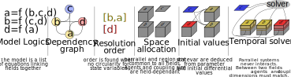

# Welcome in CHIMES ! 

CHIMES is a Python library designed for exploring, prototyping, analyzing, and coupling dynamical models.

CHIMES stands for **C**ore for **H**olistic **I**ntertwined **M**odel for **E**nvironmental **S**implicity. This acronym encapsulates the library's focus on providing a comprehensive and interconnected modeling environment for understanding systemic changes.


Developed initially as an internal tool for the Environmental Justice Program (EJP) at Georgetown, CHIMES has evolved into an open-source numerical environment with a range of features:

- An ensemble of user-friendly method to manipulate, run, explore, save models and their simulations
- A model base containing macroeconomic, climate, agent-based, circuits, and partial differential equation models. Each model includes logic, presets, explanations, and examples.
- A fieldbase (quantities relevant to describe the systems such as temperature, price and GDP) with definitions, symbols, units that can be shared across models.
- A Database that contains value of the real world related to models (WIP)
- A tensor-based resolution system with an RK4 solver, facilitating efficient parallel and complex structure modeling.
- An ensemble of `get` and `set` methods for understanding and modifying model conditions.
- Additional methods for sensitivity and stability analyses.
- Easy-to-access plots for visualizing model outputs.
- A methodology for coupling external models through an API.

## CHIMES 101 

To get started with CHIMES, we recommend a quick introduction to the `Hub` object. Learn more in the `03Hub_Basics.ipynb`.

### Why should I use CHIMES ?
 Because you want to...
* focus on your model and its properties, not the code around it
* prototype in a few lines a new model idea, and see its properties
* couple models/modules together
* go beyond a one simulation approach, and integrate uncertainty propagation
* You eventually want to disaggregate its properties 
* You want to do interactive runs, dashboard outputs
* You want to share your models and explore the ones of the community
* You want to connect your own programs to the results, typically with other python files 
* You prefer the power of open-source, especially when it's faster

## Why this acronym ? 

Of course, scientists loves acronym. Especially when the overall name has meaning as well as the individual components. It's the cae here !

### What is a chime ? 

**A Musical Ensemble of Instruments in Interaction:** A chime is a percussive musical instrument composed of individual modules that vibrate. Each module possesses unique properties and vibrations, and the true melody emerges when these modules interact. Individual bells in a chime resonate together, transferring momentum vigorously—a metaphor for systemic propagation during crises. 
This mirrors our world: subsystems are interesting in isolation but become more compelling when interacting. The "ding" sound of a chime represents the direct impulse applied to a system, a Dirac that describe its tranfer function.

**A Doorbell:** Chimes are often used as a doorbell, the first element to enter a new place. 
CHIMES is a good entry door in the real of complexity, dynamical systems, and ecological economics. 

**An Alert Sound:** Chimes sound are soft but, used as notifications and alert: we are deep in an unsustainable system that can cause it own collapse. CHIMES aims at ringing the alarm, while proposing endogenous solutions to avoid our common downfall

**An Intervention:** "_To chime in_" means entering a discussion and contributing to it. Economic modeling faces a crisis, and CHIMES aims to bring new methods of dialogue, arguments, and collaboration for a paradigm shift in economic modeling. 

### CHIMES as an acronym 

#### Core
As a numerical tool, CHIMES can link elements (fields or at a larger scale, modules) to build models. It is not the outcome of a project by itself but rather a solid foundation on which users and modelers can build.

#### Holistic
Holistic is often used to describe what we need for the anthropocene and all the related crises, yet impossible to model: a model is a reduction, an holistic model is thus impossible. Yet, model can be relevant and the intention here is "given the complexity of the world, how can we do models that are relevant and open on other models ? 
In consequence, to model a system, one has to be smart, and rely on connections, interactions, rather than the properties of one module

#### Interwined
Everything impacts everything. If that's the case, nothing can be fully reduced. We often cut things into silos to understand them better, sometimes losing the important part: inter-module feedback. A systemic model in CHIMES is thus an ensemble of intertwined modules linked through coupling approaches.

#### Models
A model is explicit reasoning. As such, it is open to criticism, improvement, understanding, and can be used to build something more extensive. CHIMES offers a multitude of models that are compatible and substitutable, promoting modularity in a systemic approach. This modularity allows better understanding, comparison, and selection of the most relevant models for coupling.

In consequence, these modules can often be called "Toy-models" in a noble sense.

#### Environment
"Environment" refers to more than just climate or biodiversity; it is the surroundings and external conditions of a subsystem. The environment is driven by its own environment, and a multitude of sub-environments will generate or influence their own environment. For example, macroeconomics studies the environments (prices, wages, inflation rate, interest...) in which agents act, with a macroeconomic environment mostly feeding back on itself.

#### Simplexity
"Simplexity" is the fusion of "Simplicity" and "Complexity":
- Simple in opposition to complicated: understanding the properties of a system is clear.
- Complex in opposition to linear: new properties emerge unexpectedly when written one by one.

"Simplexity is the art of making complex things simple, readable, and understandable."
"chose complexe dont on a déconstruit la complexité que l'on sait expliquer de manière simple"

Simplexity is the edge between quantitative accuracy and qualitative understanding. The goal is to be relevant in terms of numbers while being as accurate as possible. Complexity, through emerging properties and interactions, is often a good approach for such goals.

## Another dynamical system library? 

While there are already numerous libraries for model simulations, the CHIMES architecture introduces innovative elements that significantly enhance the modeling experience.

The advantages of CHIMES over other architectures include:

* **Flexibility of Model Files:**
  Model files in CHIMES are exceptionally flexible, accommodating both concise prototypes and more complex structures involving external model coupling or intermediate calculations. This adaptability allows for efficient and dynamic model creation.
* **Interactive Model Interaction:**
  Model files in CHIMES can interact with each other, facilitating the structuring of complex models or emphasizing specific modifications. They can also access undefined information from a shared library, fostering collaborative development.
* **Efficient Tensor Solving:**
  CHIMES is structured to solve tensors for each field, enabling easy distribution of parameter values, handling multiple regions, and managing multiple-agent dynamics at a low computational cost. Considerable efficiency is achieved through this approach.
* **Specialized Analysis Toolboxes:**
  CHIMES offers multiple analysis toolboxes and plots specifically tailored for the architecture. These tools contribute to scalable and effective model analysis.
* **Highly Interactive Simulations:**
  Simulations in CHIMES are highly interactive, allowing for "user endogenisation" and gamification of models. Users can actively participate in the simulation process, contributing to a more engaging and dynamic modeling experience.
* **Fully Open-Source:**
  CHIMES is fully open-source, emphasizing transparency, collaboration, and community contributions. This open nature encourages users to explore, modify, and contribute to the library's continuous development.

In summary, CHIMES stands out as a versatile and interactive dynamical system library, offering unique features that simplify model creation, analysis, and user engagement.


## What is a model in CHIMES ? 

A model in a reduction of the universe into a simplified system, which is easier to understand and test changes than the reality. That system is composed of two entities : 
* Fields, that are quantities relevant in the universe (temperature, age, GDP, prices...)
* Logics, that defines how each fields are linked to each others. Those logics are often mathematical equations. To each field is associated a logic, that will connect it to other fields. 

In consequence, a model is a web of fields connected to each others. 


*From left to right:* 
- *Fields (Temperature T, Labor L, Capital K, Output Y) as relevant quantities of a model.*
- *Network representation of equation. The links are showing How each value is determined*
- *Network representation of a model (here a Goodwin), how each variable depends of each. The color code is Red for differential variables (the variation of their value is deduced from the equation), Yellow for state variables (the value is deduced) blue for parameters (the value is exogenous, or constant, without any logic associated to it).*
- *A Network representation of modules connected together: Each part is a model that can be run on its own and studied on its own, or coupled together inside one model.*


A model can be seen in between four scales: 
1. Fields, quantities that exist and are relevant in the model
2. Logics that locally link locally some fields
3. The ensemble of logics that web the system and makes a model
4. Connection between models (that are thus module of a bigger model)
To understand a model, it is practical to always explore the system through those steps. 


Dynamical system have tendency to loop on themselves: the iteration of the logics will produce the time evolution. 

Behind that object is a set of equations, that can be sometimes studied as such and spotlight some relevant properties. While each relation can be understood separately, the global behavior of all fields together can be unsuspected at first: this is emergence, the main interest of doing complex systems. 

Finally, adding specific values allows also the study of scenarii, prospective, simulations and other quantitative approaches. 

Models can be overly complicated and be percieved as "black boxes", the goal is here to do the opposite: explain how they work, allow maximum possibility of manipulations for users. We try to bring the "Toy-Modeling" approach in its noble sense to the next level. 


## Library structure
 
The library is composed of the following folders
* `models` that contains default models
* `notebooks` Organized by modelers files to explore the library, inspiration for new users
* `saves` by default where your saved runs can be found by default
* `docs` the content of the `readthedocs` folder with its tutorials
* `paper` the content of the `Journal of Open Source Software` article
* `chimes` All the content of the library beyond model files and description of the library
    * `plots` contains all the plot functions related to chimes
    * `libraries` contains all the default libraries (fields, operators, functions) that can shorten model writring 
    * `config` contains config files, that you can edit to change the library overall behaviore
    * `_core_functions` contains deeper files on how the library works 


# How the library works ? 

* there is an ensemble of scan functions `[''].get_['']` than will look at everything CHIMES can interact with (model files, plots, presets, saves...), you can see the main part in `02_CHIMES_get.ipynb`
* the main object of the library is called the Hub, that will do all the task you ask him to (load a model, run simulation, analyses...). It is as the center of the library, you can see his main properties in `03_Hub_Basics.ipynb` and his get properties in `04_Hub_get.ipynb`
* the workflow can be seen as :


```python
from IPython.display import SVG, display
display(SVG('CHIMES DATA.svg'))
```


    

    


* the typical workflow is the following : 
    1. You scan the content of the library to find a model you want to explore (or you create your own) `chm.get_available_models()` and `chm.get_model_documentation()`
    2. You load the model in a hub `hub=chm.Hub(modelname)`
    3. You explore his properties `hub.get_summary()`, change the values of parameters, conditions, number of regions if relevant `hub.set_fields`
    4. You do a numerical simulation `hub.run()`
    5. optional: You do additional analyses `hub.calculate...` 
    6. optional: You retrieve the data `hub.get_dfields()` or `hub.get_dvalues()` to do your own things (see `06_Hub_datastructure.ipynb`)
    7. optional: You display your data with `hub.plot` or one of the plot in `chm.Plots` (see `05_Hub_plots.ipynb`)
    8. optional: You save your run with `hub.save('savename')`
    9. optional: if you have done analyses or plots outside of the library functions, you can add them to the model file in his `supplements` section 
    
# I want to write my own models ! 

We really hope you'll get there. Try to explore the tutorial first, then check `08_Model_files.ipynb`. You'll learn everything about them there. You can also open examples, typically in `models/EXAMPLES`


## License

This project is licensed under the MIT License - see the [LICENSE.txt](LICENSE.txt) file for details

## Acknowledgments

* The project has been funded by the [Georgetown Environmental Justice Program](https://environmentaljustice.georgetown.edu/) then by [Georgetown Earth Commons](https://earthcommons.georgetown.edu/). We thank Gael Giraud, Peter Rozic, and Peter Marra for their support. 


